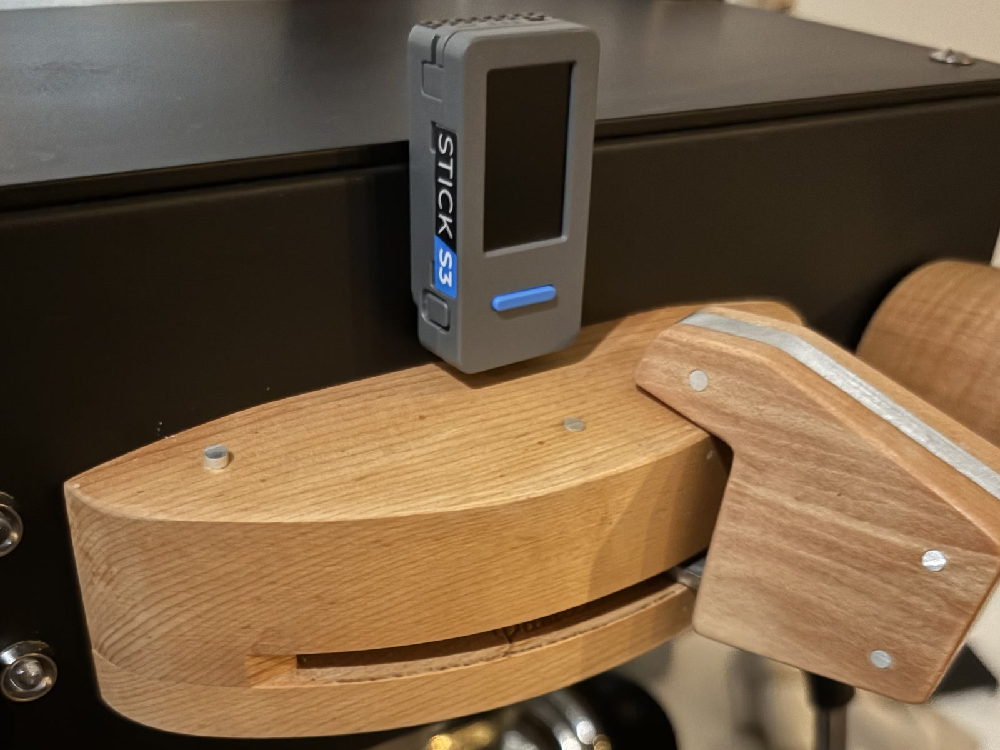
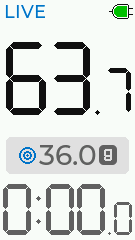
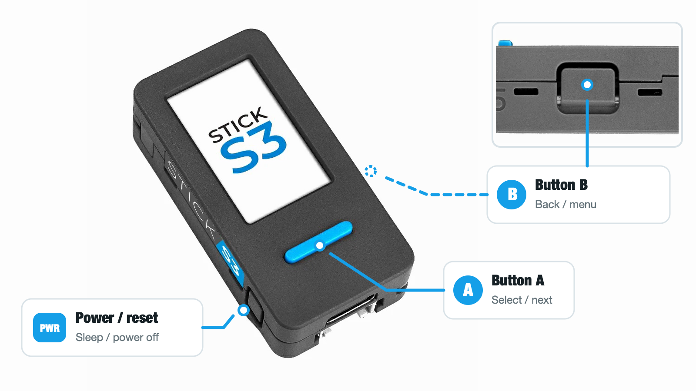
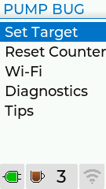
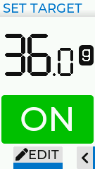
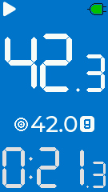
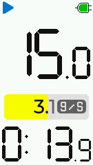
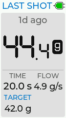
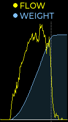
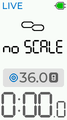

# Pump Bug user guide

Pump Bug turns an M5Stack M5StickS3 into an espresso extraction monitor. It
detects the pump through vibration, combines that signal with the weight from a
supported Bluetooth scale, shows live yield and flow, predicts when to stop for
a target yield, and keeps a local shot history.

Pump Bug is a measuring and alerting aid. It does not control the espresso
machine or stop the pump for you.

This guide applies to Pump Bug firmware 0.1.x.

> **Important:** Leave Pump Bug on the `LIVE` screen before starting an
> extraction. Pump detection, scale connection, and shot recording are active
> only while that screen is in the foreground. From another screen, hold B to
> return directly to `LIVE`.

## What you need

- An M5Stack M5StickS3 running Pump Bug.
- A first- or second-generation Acaia Lunar.
- A USB data cable for installing or updating the firmware.
- A phone or computer on the same Wi-Fi network if you want to use the browser
  interface. Wi-Fi is optional for on-device use, but required for shot
  timestamps (the StickS3 doesn't have a real-time clock).

Pump Bug is designed to attach magnetically to the front of the espresso
machine. Keep it on a stable metal surface where it can sense the pump without
being exposed to excessive heat, steam, or splashes.

> **Heat and moisture:** Pump Bug has not undergone long-term environmental
> testing while attached to an operating espresso machine. Use it at your own
> risk. Mount it on a stable exterior surface away from excessive heat,
> steam, water, and splashes. Remove it from the machine when not in use or if
> the device becomes unusually hot.

## Install the firmware

Installing or reinstalling firmware with M5Burner erases all of the device's
data and settings, including any Pump Bug shot history, the shot counter, Wi-Fi
settings, and browser pairings. Download any shots you want to keep before
reinstalling the firmware.

### M5Burner

M5Burner is the recommended installation method for most users. It is M5Stack's
official firmware installer for Windows, macOS, and Linux.

1. Download and install [M5Burner from M5Stack](https://docs.m5stack.com/en/uiflow/m5burner/intro).
2. Open M5Burner, search for **Pump Bug**, and download it from the StickS3
   catalog.
3. Connect the M5StickS3 directly to the computer with a USB data cable.
4. On the Pump Bug firmware page, select the latest stable version from the
   version menu, then choose **Burn**.
5. M5Burner identifies Pump Bug as unofficial firmware. Review its notice and
   choose **Continue**.
6. In the burn dialog, select the device's serial port, leave the baud rate at
   its default, and choose **Start**.
7. Wait until M5Burner reaches `Finished` without reporting any errors. It
   normally puts the device into download mode and restarts it automatically.
8. Once Pump Bug has started, disconnect the cable if desired.

If M5Burner cannot start the installation, put the M5StickS3 into download mode
manually: hold its side power/reset button for about two seconds, then release
it when the internal green LED flashes. The screen may remain blank. Refresh
the port list afterward, since the device may reconnect with a different port
name. If the device does not restart after M5Burner reaches `Finished`, press
the side power/reset button once.

Do not disconnect the USB cable while the firmware is being written.

### PlatformIO for developers

Developers can build and upload Pump Bug from source with PlatformIO. Follow
the repository's [build and upload instructions](../README.md#build), which
also cover the custom flash layout and the cases that require a full-device
erase.

## First start

On its first start, Pump Bug presents a seven-screen `Tips` tour. It introduces
the buttons, power behavior, screen rotation, `LIVE` screen, and main menu. You
can open the tour again later from `PUMP BUG` > `Tips`.

1. Complete the `Tips` tour.
2. Attach Pump Bug to the front of the machine.
3. Turn on the scale and place it under the cup.
4. Return Pump Bug to `LIVE`. It scans for the scale automatically.
5. Wait until `no SCALE` is replaced by a weight reading.
6. Place the empty cup on the scale before starting the pump and leave it still
   for a moment.

You do not have to tare the cup manually. Pump Bug treats the stable weight
immediately before the pour as zero for that extraction. If the scale is not
tared, the large number is the extraction yield (net weight) and a smaller
number appears to show the raw weight reported by the scale. To tare the scale
itself, hold A while `LIVE` is idle.

## Controls

Pump Bug uses all three buttons: A on the front below the screen, B on one side,
and power/reset on the other side closer to the USB-C connector.

| Control | Usual action |
|---|---|
| Tap A | Move to the next item or view; change the selected value while editing |
| Hold A | Select, edit, confirm, or perform the action shown for the current screen |
| Tap B | Go back; from `LIVE`, open the main menu |
| Hold B | Return directly to `LIVE` from most other screens |
| Tap the power button | Put Pump Bug to sleep |
| Double-tap the power button | Switch the device off |
| Rotate the device | Rotate the display and wake it from sleep |

On menu screens, tap A to move the highlight, hold A to open the highlighted
item, and tap B to go back.

If the display has dimmed, the first button press may only wake it. Press the
button again after the screen brightens to perform the intended action.

## Pull a shot

For a normal extraction:

> **Shot time requires Wi-Fi:** If you want the shot to have a date and time,
> turn Wi-Fi on and wait for Pump Bug to connect before starting the pump. The
> timestamp is captured when recording begins. Connecting after the shot does
> not add a time retroactively.

1. Turn on the scale and confirm that `LIVE` shows its weight.
2. Put the cup on the scale before starting the pump.
3. Make sure Pump Bug is still on `LIVE`.
4. Start the pump. Recording begins automatically when Pump Bug recognizes the
   pump's vibration.
5. Watch the live yield and timer, together with either the target progress band
or flow meter.
6. Stop the pump yourself, using the target alert if it is enabled.
7. Leave the cup in place briefly while the final drips settle.

Pump Bug continues measuring for a short time after the pump stops so the final
yield includes coffee still falling into the cup. A brief pump restart can be
joined to the same extraction.

When Pump Bug detects pump vibration, a blue outline appears around the target
progress band (or the flow band, if the target alert has not been enabled). The
alert stop cue only triggers while vibration is detected. The timer starts dim
and brightens once scale readings confirm a pour.

Pump Bug does not save every period of detected activity as a shot. It records
an extraction only after detecting sustained flow and meaningful weight gain.
This keeps brief flushes, scale bumps, grinder doses, and other incidental
activity out of the counter and history.

## Predictive yield alert

The predictive alert tells you when to stop the pump so the final yield lands
near the selected target. It estimates current flow and expected
carryover; the stop cue can therefore occur before the scale itself reaches
the target.

### Set a target

1. From `LIVE`, tap B to open the `PUMP BUG` menu.
2. Highlight `Set Target` and hold A.
3. Hold A to enter editing and move through the tens, ones, half-gram, and
   `ON`/`OFF` fields.
4. Tap A to change the selected field's value.
5. Set the alert to `ON`.
6. Tap B to save and return.
7. Hold B to return to `LIVE`.

Targets can be set from 10.0 g to 99.5 g in 0.5 g steps. Changing the target
automatically turns the alert on; the `ON`/`OFF` field can disable it without
changing the saved weight.

| Main menu | Target editor |
|:---:|:---:|
|  |  |

### Read the alert

- As the predicted stopping point approaches, Pump Bug sounds short countdown
  beeps.
- At the predicted stopping point, the screen turns blue and a sustained tone
  tells you to stop the pump.
- Tap A to silence the sustained tone. The visual stop cue remains until the
  extraction finishes.

The target and alert settings used for a shot are stored with that shot. A
later replay therefore reproduces the target behavior that applied when the
shot was recorded.

Prediction depends on a steady stream of valid scale readings. Treat the alert
as guidance when the scale reconnects, the cup is disturbed, or the flow is
unusual.

*The blue stop cue (reproduced by replaying a shot recorded with a 42.0 g
target).*

## Flow measurement

When the target alert is off, the band displays flow in grams per second. Pump
Bug filters the readings to reject common scale noise and abrupt disturbances,
so the displayed flow is steadier than a simple difference between two weights.
This filtering also means very brief changes may appear with a small delay.

After the extraction, the `LAST SHOT` summary shows sustained peak flow. The
next view shows weight and flow together as a chart:

1. From `LIVE`, tap A for `LAST SHOT`.
2. Tap A again for the weight-and-flow chart.
3. Tap A once more to return to `LIVE`.

The scale's own timer is not controlled by Pump Bug. When timer data is present
in the scale messages, Pump Bug can use it to improve measurement timing.

## Last shot and replay

The device keeps the most recent completed shot ready for quick review. On the
`LAST SHOT` screen you can see when it was recorded, its yield, duration,
sustained peak flow, and the target used for the shot. It shows `time unknown`
when no date and time were available at the start of recording. Recent shots
show relative times such as `just now`, `12m ago`, or `1d ago`; older shots
show an absolute date and time.

To replay it, hold A on either `LAST SHOT` or its chart. Replay reconstructs the
recorded extraction on the device without changing the saved shot or the shot
counter.

During replay:

- Tap A to pause or resume.
- Hold A to switch between the recorded target display and the flow band.
- Tap B to return to `LAST SHOT`.

Do not pull a real shot during replay; live extraction recording is suspended
until you return to `LIVE`.

| Last-shot summary | Weight and flow chart |
|:---:|:---:|
|  |  |

## Shot counter

The status bar counter is the lifetime count of extractions Pump Bug recognized
as shots. It is independent of saved history: when history fills, the oldest
records are removed while the counter continues increasing. The on-screen
count is shown as `999+` after 999.

To reset it, open `PUMP BUG` > `Reset Counter`, then hold A to confirm. Resetting
the counter does not delete saved shots.

## Web interface

Pump Bug can serve a local browser interface over Wi-Fi for live monitoring,
shot review and download, replay loading, and diagnostics. Wi-Fi is optional
for on-device measurement.

Read the [Pump Bug web interface guide](web-guide.md) for Wi-Fi setup, browser
pairing, history, settings, diagnostics, and browser troubleshooting.

## Espresso machine compatibility

Pump Bug's vibration detection has been tested on a La Marzocco Linea Mini and
a San Remo Cube with an E61 group. Other machines may produce different
vibration patterns, so verify pump and shot detection on your machine before
relying on its records or alerts.

## Scale compatibility

Pump Bug has been tested with:

- Acaia Lunar, first generation.
- Acaia Lunar, second generation.

Other scales have not been tested. Some may use a Bluetooth profile that the
firmware recognizes, but appearing in a scan—or even connecting—does not
imply reliable shot recording.

Pump Bug searches for a scale automatically while `LIVE` is open and reconnects
if the link drops. For a predictable connection, keep only the intended scale
awake nearby and disconnect it from the Acaia app or any other device that is
currently using its Bluetooth connection.

## Power management and useful tricks

- **Automatic sleep:** On battery, Pump Bug sleeps after about five minutes
  without activity. Moving or rotating it wakes it.
- **Display dimming:** The display dims after about one minute. The first button
  press may wake the display without performing its normal action.
- **External power:** USB power prevents the idle sleep timer, which is useful
  for a permanently installed device. The display can still dim.
- **Low battery:** A sustained low-battery condition causes an orderly shutdown
  rather than continuing with unreliable operation.
- **Faster return to recording:** Hold B from most screens to return directly to
  `LIVE`.
- **No manual cup tare required:** Put the cup in place before the pour and Pump
  Bug measures yield relative to its starting weight.
- **Scale tare shortcut:** Hold A while `LIVE` is idle to send a tare command to
  the scale.
- **Clear the finished live shot:** After a shot finishes, hold A on `LIVE` to
  clear the current finished display. The saved history record remains.
- **Rotate to fit:** The screen follows device orientation, so portrait and
  landscape mounting both work.
- **Save battery when offline:** Turn Wi-Fi off when you do not need the browser
  interface. The scale connection and on-device shot functions still work.

Pump Bug also reduces processor speed while idle, turns the speaker amplifier
off when silent, and disables unused external power output. These changes are
automatic and require no setup.

## Storage warnings and data removal

`NOT RECORDING` means shot storage is unavailable. `SHOT NOT SAVED` means Pump
Bug recognized the latest completed extraction as a shot but could not write it
to history. In either case, do not assume the shot is in history. Open
`PUMP BUG` > `Diagnostics` to inspect the device and storage status.

`Diagnostics` includes runtime logs, the `Pump signal` view, a Bluetooth scan
tool, a scale message tool, and storage recovery when needed. These screens are
primarily for troubleshooting.

`Pump signal` checks vibration detection only. Use the `DETECTED` state to
assess a mounting position. For a representative test without using coffee,
install a blind basket and run short pump cycles following the machine
manufacturer's backflushing instructions. The other rows show technical
parameters for advanced users or developers. Pump operations on this screen are
not recorded as shots or added to the `Pump detect` log. The test stops after
five minutes; tap A to restart it.

`Diagnostics` > `Erase all data` is destructive. It removes all shot history,
the shot counter, Wi-Fi configuration, browser pairings, and stored crash
information, then restarts the device. Download anything you want to keep
before confirming it.

## Troubleshooting

### The scale does not connect

- Return to `LIVE`; the scale radio is not active on other device screens.
- Make sure the scale is on, awake, charged, and close to Pump Bug.
- Disconnect the scale from the Acaia app or another Bluetooth client.
- Power-cycle the scale, then wait for Pump Bug to search again.
- Open `Diagnostics` > `BLE scan` to confirm that the scale is visible. Use
  `Scale msgs` when more detailed diagnosis is needed.

### A shot was not recorded

- Confirm that Pump Bug was on `LIVE` for the whole extraction.
- Confirm that a live weight was visible before starting the pump.
- Make sure Pump Bug is firmly attached to the machine and was not moved during
  the extraction.
- Open `Diagnostics` > `Pump signal`, run the pump, and confirm that the state
  changes to `DETECTED`. Try another mounting position if detection is unstable.
- Very short operations or events without enough weight gain are intentionally
  not recorded as shots.
- Check for a `NOT RECORDING` or `SHOT NOT SAVED` warning.

### The target alert did not sound

- Open `Set Target` and confirm the target is `ON`.
- Confirm the scale is connected and updating throughout the pour.
- Open `Diagnostics` > `Pump signal` and confirm that the state remains
  `DETECTED` while the pump runs.
- The alert needs a valid flow estimate and may not trigger during a disturbed,
  interrupted, or unusually short extraction.
- Make sure the speaker opening is not obstructed and the environment is quiet
  enough to hear the cue.

## Firmware version

The browser interface reports the installed firmware version. See
[Open the interface later](web-guide.md#open-the-interface-later) for where to
find it.
