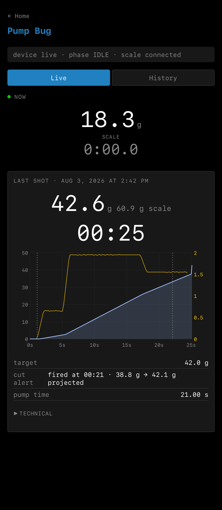
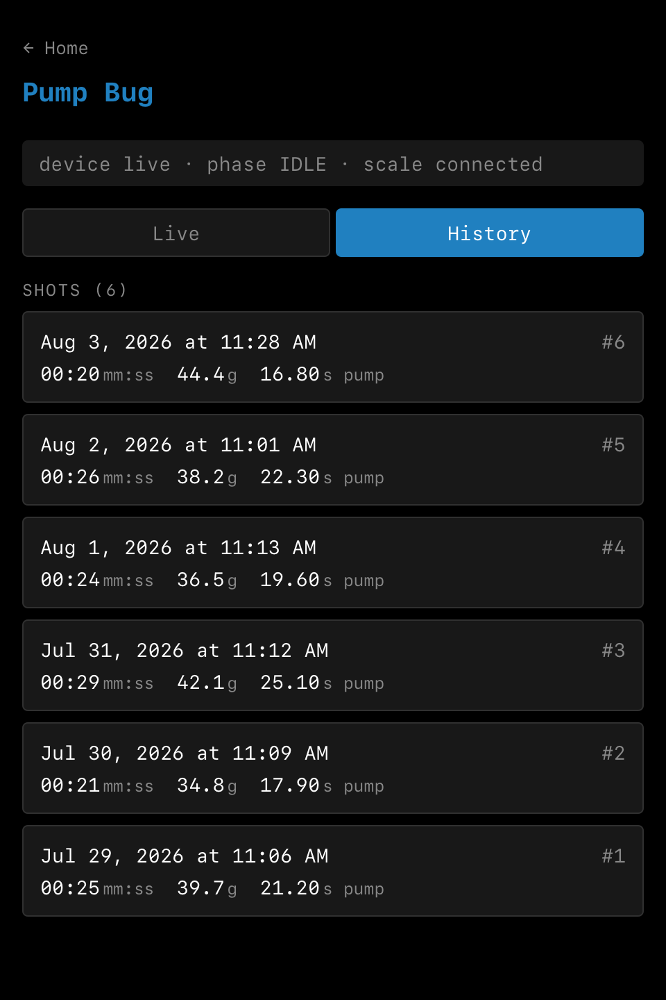
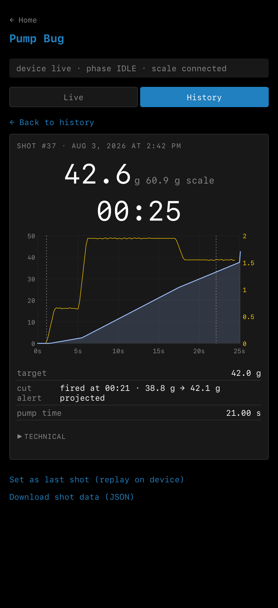

# Pump Bug web interface guide

Pump Bug serves its browser interface directly from the device. Use it from a
phone or computer to follow an extraction, inspect and download saved shots,
load an older shot for replay, manage Wi-Fi and browser pairing, and view
diagnostic logs.

The interface is local: it needs no Pump Bug account or cloud service. The
device and browser must be awake and connected to the same Wi-Fi network.

This guide applies to Pump Bug firmware 0.2.x.

The screenshots below use representative shot data. Their layout, labels,
charts, and controls are the actual firmware interface.

> **Shot time requires Wi-Fi:** Pump Bug obtains its clock over the network.
> Turn Wi-Fi on and wait for it to connect before starting a shot if you want a
> date and time in `LAST SHOT` and `History`. The timestamp is captured at the
> start of recording. Connecting later cannot add a time to an existing shot.

## Connect Pump Bug to Wi-Fi

1. On the device, open `PUMP BUG` > `Wi-Fi`.
2. If no network is saved, the setup wizard opens automatically. If a network
   is saved but Wi-Fi is off, open `SETTINGS` and choose `Wi-Fi on`.
3. Scan the first QR code to join Pump Bug's temporary setup network.
4. Follow the next QR code into the setup page, choose your normal Wi-Fi
   network, and enter its password.
5. After Pump Bug connects, reconnect the phone or computer to that same normal
   network.

If Pump Bug cannot join the selected network, it returns to its temporary setup
network and displays the failure reason. Repeat the setup and check the network
name and password.

## Pair a browser

Each browser profile must be paired before it can open protected pages.

1. On Pump Bug's connected `WI-FI` screen, tap A for `VISIT`.
2. Scan the QR code. A browser that is already paired opens the Pump Bug home
   page; a new browser is paired as the link opens.
3. If you cannot scan the code, tap A for `TEXT`. Enter the displayed `.local`
   address or IP address in the browser, then enter the four-digit PIN.

The pairing window lasts 60 seconds. Start `VISIT` again if it expires. Pump
Bug remembers up to eight paired browser profiles; pairing a ninth removes the
oldest authorization.

Pairing is access control, not internet encryption. Pump Bug uses ordinary HTTP
on the trusted local network. Do not expose the device directly to the internet
or share a pairing link, PIN, or command-line cookie.

## Open the interface later

Open the hostname shown on the device's Wi-Fi `TEXT` view, for example:

```text
http://pumpbug-a1b2c3.local/
```

The default hostname contains a suffix unique to the device. If the `.local`
name does not resolve, use the IP address shown on the same device screen. An
IP address can change when the router reconnects the device, so the hostname
is preferable when it works.

The home page has three areas:

- `Shot Dashboard` opens the Live and History views.
- `Pairing & Wi-Fi` shows connection status and network settings.
- `Logs` exposes diagnostic and support information.

The installed firmware version appears below these cards. Include it when
reporting a bug or checking which firmware is installed.

## Live dashboard

The banner at the top summarizes whether the device is live, the extraction
phase, and the scale connection. Pump Bug must be showing `LIVE` on its own
display to detect the pump, connect to the scale, and record an extraction. If
the browser says `device idle`, return the device to `LIVE`.



### Now

While idle, `Now` shows the scale's current raw weight and a parked timer.
During an extraction, the card switches to the self-tared yield, running timer,
and live weight-and-flow chart. Self-tared means that Pump Bug subtracts the
stable pre-pour cup weight, so the displayed yield measures the coffee added
even if the scale itself was not tared. If the pump is active but scale data is
not yet usable, the chart area reports that it is waiting for the scale or for
samples.

### Last shot

The latest completed shot appears below `Now` with:

- Its date and time, or `time unknown` if the clock was not available when the
  shot began.
- Final yield and duration.
- The raw scale weight in smaller text when it differs from the yield because
  the scale itself was not tared.
- A chart with weight in blue, flow in yellow, and dashed pump-on and pump-off
  markers.
- The target, cut-alert outcome, and total pump-on time.
- A collapsed `Technical` section with raw fields useful for diagnosis.

If the cut alert fired, `fired at` shows the trigger time and yield; `projected`
shows the final yield Pump Bug predicted at that moment.
Otherwise the row reads `armed · didn’t fire` when the alert was on for that
shot but never reached its cue, or `off` when the target alert was not enabled
when the shot was recorded.

During an active pump window, the last-shot card collapses so the current pour
has priority. Select the collapsed card to expand it temporarily.

Only one browser can hold the live event stream at a time. Opening the dashboard
in another browser replaces the first live stream; the displaced page will try
to reconnect. Use one Live dashboard when monitoring a pour. Ordinary pages
and history requests are unaffected.

## Shot history

Choose `History` on the dashboard to list saved shots, newest first. Each row
shows its date and time, shot ID, duration, final yield, and pump-on time.



The first page contains up to 20 shots. Choose `Load older` to show the next
page below the existing records. Pump Bug stores up to 250 saved shots. When
the store is full, saving a new shot removes the oldest saved shot.

History and the lifetime shot counter are independent. Resetting the counter
does not delete history, and the counter can be greater than the number of
records still stored. There is no individual-shot delete action.

Download any records you want to retain before a firmware operation that erases
data or before they age out of storage.

## Inspect a shot

Select a History row to open its detail page. It uses the same result card as
the Live view, including the weight-and-flow chart, target and alert outcome,
pump time, and technical fields.



### Read the chart

- The blue curve and shaded area show yield in grams.
- The yellow curve uses the right axis and shows filtered flow in grams per
  second.
- Dashed vertical markers identify pump-on and pump-off events.
- With a mouse, point at the chart to inspect a time, weight, and flow value.
  On a touch screen, press and drag across the chart.

Scale gaps or rejected disturbances appear as breaks rather than invented
measurements.

### Download shot data

Choose `Download shot data (JSON)` to save the decoded record to the browser's
download folder. The file is named `shot-<id>.json` and contains shot metadata,
target and alert state, pump events, and the recorded scale samples.

Measurement field names ending in `Cg` use centigrams; divide by 100 for grams.
Time field names ending in `Ms` use milliseconds.

Downloading a shot does not remove or change it on Pump Bug.

### Load a shot for device replay

1. On the shot detail page, choose `Set as last shot (replay on device)`.
2. Wait for the confirmation banner.
3. On the device, return to `LIVE` and tap A to open `LAST SHOT`.
4. Hold A on the summary or chart to begin replay.

This replaces only the device's currently loaded `LAST SHOT`. It does not add,
remove, or reorder history and does not change the shot counter.

## Pairing and Wi-Fi settings

Open `Pairing & Wi-Fi` from the home page to see the current mode, connection
state, network name, IP address, and hostname.

From this page you can:

- Change the Wi-Fi network.
- Set an mDNS hostname of 1–31 letters, digits, or hyphens. It takes effect
  after the next Wi-Fi restart, and browsers must pair again at the new name.
- Reveal the paired cookie for command-line or API access. Treat this cookie as
  a password and reveal it only when needed.
- Choose `Forget Wi-Fi and unpair all clients` to remove the saved network and
  every browser authorization.

The device's `WI-FI` screen also offers these controls:

- `Wi-Fi off` stops Wi-Fi but keeps the saved network.
- `Network` starts the setup wizard to change networks.
- `Unpair` removes browser authorizations without forgetting the network.

## Diagnostic logs

The browser `Logs` page is mainly for troubleshooting and support. It contains:

- `Shots`: recent extraction decisions, including activity Pump Bug did not
  record as a shot.
- `Pump detect`: recent vibration-detection starts and stops, with signal
  measurements at each transition and the conditions that ended detection.
- `Net`: Wi-Fi and HTTP events.
- `BLE scan`: nearby Bluetooth devices while `Diagnostics` > `BLE scan` is open
  on the device.
- `Scale msgs`: decoded scale traffic while `Diagnostics` > `Scale msgs` is
  open on the device.
- `Power`: current battery and external-power state plus wake and sleep history.
- `Memory`: current allocator status, low-water marks, and recent pressure.
- `Crash`: the most recently stored crash summary, if one exists.

Most tabs require a paired browser. The crash summary remains readable without
pairing so a crash that affected saved authorization does not hide the evidence.

Where shown, `Clear` permanently erases that diagnostic log after confirmation.
It is not available for `BLE scan` or `Scale msgs`, and it does not delete shot
history.

## Troubleshooting

### The browser cannot open Pump Bug

- Wake the device and confirm its Wi-Fi screen says connected.
- Put the browser on the same network. Guest networks and client-isolation
  settings may prevent local devices from reaching one another.
- Try the IP address from the device `TEXT` screen if the `.local` name fails.
- Start `VISIT` again if the browser was unpaired or the pairing window expired
  before pairing completed.
- After changing the hostname, restart Wi-Fi and pair at the new name.

### Live says the device is idle

Return Pump Bug to its on-device `LIVE` screen. The browser cannot activate
pump detection or scale recording by itself.

### A date says `time unknown`

The device clock was unavailable when that shot started. The stored record
cannot be backfilled. Enable Wi-Fi and wait for a connection before the next
shot.

### History is unavailable or the latest shot was not saved

Check the device for `NOT RECORDING` or `SHOT NOT SAVED`, then open
`PUMP BUG` > `Diagnostics` to inspect storage. Do not assume the missing record
can be recovered.

### The Live page keeps reconnecting

Make sure another phone, computer, or browser tab is not holding the single live
stream. Keep one dashboard open during an extraction. The page also reconnects
automatically after the device sleeps and wakes, but the device must be awake
and reachable.

For device operation, installation, scale compatibility, and power behavior,
return to the [Pump Bug user guide](user-guide.md).
